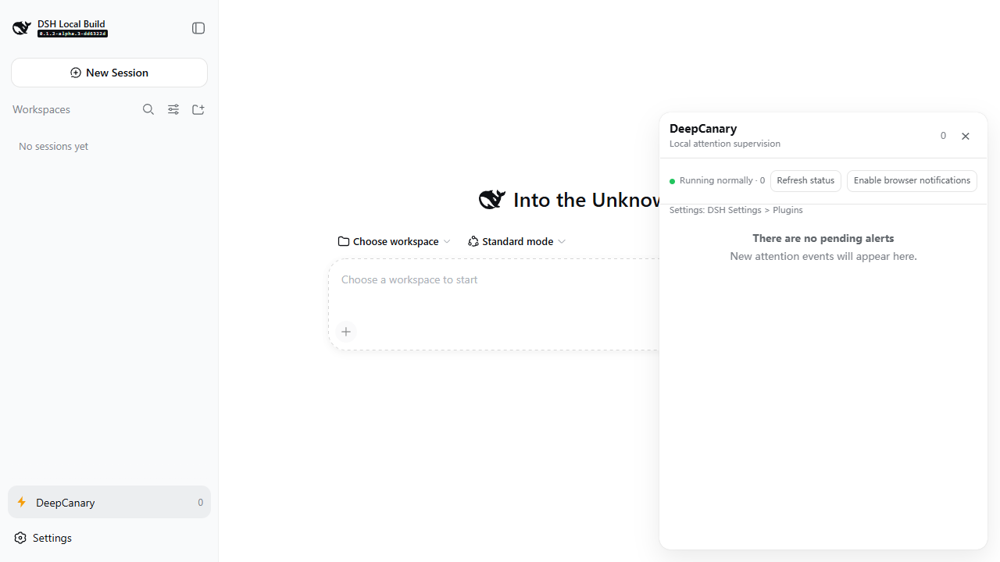

# dsh-deepcanary

[](https://github.com/Oscar-Williams/dsh-deepcanary/actions/workflows/ci.yml)
[](LICENSE)



> A quiet layer for the moments that genuinely need your attention.

`dsh-deepcanary` is a local attention-supervision plugin for [DeepSeek Harness (DSH)](https://github.com/deepseek-ai/deepseek-harness). It reads structured facts from Sessions, Tools, Agents, Subagents, and the Host, then applies deterministic policy to decide what can stay quiet, what belongs in the Inbox, and what deserves a user-facing reminder.

## Versions and compatibility

**Published prerelease:** `0.1.1-rc.1` targets the official DSH [`dsh-v0.1.2-alpha.5`](https://github.com/deepseek-ai/deepseek-harness/releases/tag/dsh-v0.1.2-alpha.5). The alpha.5 dependency update, source checks, and compatibility regression have passed, and the GitHub tag, prerelease Release, and npm `next` channel are synchronized. The official release focuses on startup failures and missing session titles during upgrades from older DSH runtimes; the Gateway, client-module, WebServer, Session, Settings, and Tools surfaces used by this plugin remain compatible. The immutable alpha.5 commit is `db6bdc3576c2d4e7c965e8e3ed0c2a731eed87f5`, and the compatibility record is [`benchmark/alpha5-compatibility-receipt.json`](benchmark/alpha5-compatibility-receipt.json).

**Current `main` engineering candidate:** `0.1.1-rc.2` adds the first alpha.5 authoritative session snapshot reconciliation slice: subscriber-first event buffering, privacy-safe state derivation from `snapshotEvents()`, epoch reconciliation, sequence-aware duplicate merging, startup Human Needed reconstruction, bounded orphan-grace convergence, and an explicit degraded status; it also keeps a bounded logical browser delivery ledger. The Persistent Supervisor is explicitly experimental and off by default in RC2; set `supervisorMode: experimental` only when running the separate Gate E engineering checks. RC2 is the source-build and regression identity for this engineering cycle; the published RC1 identity remains the daily installation path.

The public [`v0.1.0-rc.4 Release`](https://github.com/Oscar-Williams/dsh-deepcanary/releases/tag/v0.1.0-rc.4) remains available as the historical alpha.4 baseline, with its receipt in [`benchmark/release-candidate-receipt.json`](benchmark/release-candidate-receipt.json). `0.1.1-rc.1` carries forward the verified RC4 Windows, WSL2, Node.js 22/24, and Web UI foundations while incorporating alpha.5 persistence compatibility, connection-stability maintenance, notification delivery evidence, policy replay, and Supervisor diagnostics.

The current `main` branch contains the connection-stability maintenance plus the first authoritative session reconciliation slice: debounced host-probe epochs, backoff and timeout cleanup for state requests, per-attempt notification telemetry, standby takeover for the Persistent Supervisor, bounded persistence for dedupe and interrupt-budget state, and alpha.5 session-list reconciliation.

`0.1.1-rc.1` is intended for local trials, feedback, and plugin integration testing. Physical touch hardware, a real screen reader, and Windows OS-visible browser notification delivery are separate device acceptance checks; browser automation, keyboard interaction, narrow viewports, forced colors, and the notification-denied branch already have automated evidence.

Historical v0.1.0-rc.3 remains available as a Git tag for comparison; its npm version was withdrawn and cannot be reused under npm policy.

Historical [`v0.1.0-rc.2`](https://github.com/Oscar-Williams/dsh-deepcanary/tree/v0.1.0-rc.2) with official DSH `dsh-v0.1.2-alpha.2` remains available for reproduction. `v0.1.0-rc.1` and DSH npm `0.1.1-rc.2` are retained for historical environment diagnosis and are not the current installation or test baseline. Before testing, stop DSH, remove the older plugin from the profile, and install the intended version.

## What it does

DeepCanary answers one question: is this worth a human looking at now? It does not reimplement the agent loop or perform high-impact actions on the user's behalf.

- observes Human Needed, host unreachability, suspected stalls, tool-failure loops, no-progress signals, subagent pressure, context pressure, and completion events;
- uses C0–C3 attention levels, deduplication, Decision Bundles, and an hourly budget to reduce notification noise;
- keeps only a sidebar entry visible at startup; the panel opens on demand, can be closed and reopened, supports mouse or keyboard resizing, and follows DSH's Chinese/English setting;
- provides the Inbox, settings card, and evidence summaries inside that panel;
- supports acknowledge, snooze, mute, usefulness feedback, and navigation hints;
- never terminates or restarts a task, approves or rejects a request, or executes arbitrary commands.

The governing rule is evidence before escalation. C3 requires Host or Runtime authority, and model judgment is not required by this RC.

## Install and start

The four paths below serve different purposes: the GitHub tag, Release asset, and npm `next` channel support daily trial use; source builds and the local tarball support development, reproduction, and issue reports.

### Requirements

- Windows x64 or WSL2 Ubuntu;
- Node.js `22.19+` (the release verification used Node.js `24.19.0`);
- pnpm `11.7.0`;
- an official DSH source runtime; the current compatibility baseline uses `dsh-v0.1.2-alpha.5` at commit `db6bdc3576c2d4e7c965e8e3ed0c2a731eed87f5`. The historical RC4 receipt remains pinned to alpha.4.

### GitHub tag installation (published RC1): v0.1.1-rc.1

The following command installs `0.1.1-rc.1` from the immutable GitHub tag. The Release page provides the same version as a downloadable tarball asset.

#### 1. Prepare the official DSH alpha.5 runtime

```powershell
git clone --depth 1 --branch dsh-v0.1.2-alpha.5 https://github.com/deepseek-ai/deepseek-harness.git dsh-runtime-alpha5
Set-Location .\dsh-runtime-alpha5
npx --yes pnpm@11.7.0 install
npx --yes pnpm@11.7.0 run build
npx --yes pnpm@11.7.0 dsh --version
git rev-parse HEAD
```

The version command should print `0.1.2-alpha.5`, and the commit command should print `db6bdc3576c2d4e7c965e8e3ed0c2a731eed87f5`. An existing checkout may still be named `dsh-runtime-alpha1`; its tag, commit, and `dsh --version` should match these values before testing.

#### 2. Install the plugin

Use the immutable GitHub tag for the normal installation path; use the Release asset when you need an offline installation. A local directory containing personal design notes is not an installation source.

```powershell
Set-Location .\dsh-runtime-alpha5
npx --yes pnpm@11.7.0 dsh plugin --profile web add https://codeload.github.com/Oscar-Williams/dsh-deepcanary/tar.gz/refs/tags/v0.1.1-rc.1
npx --yes pnpm@11.7.0 dsh --profile web --dump-config
npx --yes pnpm@11.7.0 dsh web --no-open
```

For a Release asset downloaded to disk, pass the local tarball path to the same install command:

```powershell
npx --yes pnpm@11.7.0 dsh plugin --profile web add C:\path\to\dsh-deepcanary-0.1.1-rc.1.tgz
```

Open the DSH Web page in a browser on the same machine. `0.1.1-rc.1` keeps only the sidebar entry visible at startup; the floating Inbox opens after the entry is clicked. If browser notification permission is denied, the panel and model-visible tools remain available.

### npm `next` channel (available now)

The package is published to the official registry's `next` channel; use:

```powershell
$env:npm_config_registry = 'https://registry.npmjs.org/'
npx --yes pnpm@11.7.0 dsh plugin --profile web add dsh-deepcanary@next
```

This `next` channel currently resolves to `0.1.1-rc.1`; use the explicit `@next` selector when installing the prerelease candidate.

To update an existing RC installation, rebuild only when using a local development checkout; for an installed profile use:

```powershell
npx --yes pnpm@11.7.0 dsh plugin --profile web update dsh-deepcanary
```

### Uninstall and rollback

Remove the plugin from the target DSH profile:

```powershell
npx --yes pnpm@11.7.0 dsh plugin --profile web remove dsh-deepcanary
```

To reinstall the current published version, rerun the `0.1.1-rc.1` installation command above. To reproduce RC4 or RC2, use the matching tag and DSH runtime. Restart `dsh web` after replacing the package, then use `dsh plugin --profile web list` to confirm that the profile contains only the intended version.

### Rebuild and verify the current main engineering candidate 0.1.1-rc.2

For source debugging or reproduction, use the official DSH `dsh-v0.1.2-alpha.5` and a separate profile; replace `$pluginDir` and `$dshDir` with paths on your machine. The generated tarball is the direct acceptance artifact for the current RC2 engineering candidate; published RC1 installation and rollback continue to use the immutable tag or npm `next` channel.

```powershell
$pluginDir = 'C:\path\to\dsh-deepcanary'
$dshDir = 'C:\path\to\dsh-runtime-alpha5'
$testHome = Join-Path $env:USERPROFILE '.dsh-deepcanary-test'

git clone --depth 1 --branch dsh-v0.1.2-alpha.5 https://github.com/deepseek-ai/deepseek-harness.git $dshDir
Set-Location $dshDir
npx --yes pnpm@11.7.0 install --frozen-lockfile
npx --yes pnpm@11.7.0 run build
npx --yes pnpm@11.7.0 dsh --version
git rev-parse HEAD

Set-Location $pluginDir
npm ci
npm run build
$packDir = Join-Path $env:TEMP 'dsh-deepcanary-local-pack'
New-Item -ItemType Directory -Force $packDir | Out-Null
npm pack --pack-destination $packDir
$packageVersion = (Get-Content .\package.json | ConvertFrom-Json).version
$tarball = Join-Path $packDir "dsh-deepcanary-$packageVersion.tgz"

Set-Location $dshDir
$env:DSH_HOME = $testHome
npx --yes pnpm@11.7.0 dsh plugin --profile web remove dsh-deepcanary
npx --yes pnpm@11.7.0 dsh plugin --profile web add $tarball
npx --yes pnpm@11.7.0 dsh --profile web --dump-config
npx --yes pnpm@11.7.0 dsh web --no-open
```

`dsh --version` should print `0.1.2-alpha.5`, `git rev-parse HEAD` should print `db6bdc3576c2d4e7c965e8e3ed0c2a731eed87f5`, and the local tarball should show version `0.1.1-rc.2`. The bundle patch uses DSH's `dshHomePath('dsh-deepcanary')`, so setting `DSH_HOME` keeps plugin state inside the isolated DSH home. Before opening the Web UI, confirm that the profile loaded the current tarball and that the page shows only the sidebar entry, with no fixed legacy card on the right. For the maintenance build, also inspect `/dsh-deepcanary/health` and `/dsh-deepcanary/state` for host-probe state, outageId, reconciliation, and Supervisor status.
RC2 defaults `supervisorMode` to `off`. To validate the U7 prototype, select `experimental` in DSH Settings > Plugins for DeepCanary, restart the test profile, and inspect `supervisor.json`, the lease, reconciliation status, and smoke/soak evidence. This is an engineering-validation entry point; the current Stable core claim excludes the Persistent Supervisor.

### Web UI interactions

- **Hide:** the Inbox panel is not rendered at startup; the close button, `Esc`, and an outside click hide it without blocking the DSH page.
- **Wake:** click the DeepCanary entry at the bottom of the sidebar to reopen it; focus moves to the close button and returns to the entry after closing.
- **Notification return:** when browser notification permission is granted, clicking a C2/C3 notification focuses DSH, opens the corresponding alert, and scrolls the target item into the visible panel range.
- **Resize:** the right and bottom handles support pointer dragging and keyboard arrows, `Home`, and `End`; the size is persisted when browser storage is available.
- **Bilingual display:** panel copy, reasons, suggestions, evidence labels, actions, and settings fields are registered with DSH locale and update when DSH switches between Chinese and English.

## Web and model-visible interfaces

The plugin registers these same-origin local WebServer routes:

| Route | Purpose |
| --- | --- |
| `/dsh-deepcanary/state` | status, reconciliation identity, settings, and pending Inbox snapshot |
| `/dsh-deepcanary/settings` | read or validate and update user-facing settings |
| `/dsh-deepcanary/health` | plugin health check |
| `/dsh-deepcanary/explain?id=...` | read a privacy-safe explanation for one Inbox item |
| `/dsh-deepcanary/dry-run` | compare current and candidate alert policy without side effects |
| `/dsh-deepcanary/action` | acknowledge, mute, snooze, feedback, and navigation hint |
| `/dsh-deepcanary/outcome` | record one redacted decision outcome for a local trial |
| `/dsh-deepcanary/outcomes` | read filtered OutcomeReceipts without session content |
| `DELETE /dsh-deepcanary/outcomes` | withdraw local outcome records by an explicit trial or time cutoff |
| `/dsh-deepcanary/supervisor` | read the Persistent Supervisor prototype snapshot, lease state, and resource counters |

The DSH model can use nine tools: `deepcanary_status`, `deepcanary_inbox`, `deepcanary_acknowledge`, `deepcanary_snooze`, `deepcanary_mute`, `deepcanary_feedback`, `deepcanary_explain`, `deepcanary_dry_run`, and `deepcanary_jump`.

### Record one redacted outcome

During a dogfood or controlled trial, record an outcome after an alert using the Inbox item's `id` with `/dsh-deepcanary/outcome`. `source` must be `real`, `controlled`, or `replay`; `trialId` must be a local identifier without a path or sensitive content:

```json
{
  "id": "<Inbox item id>",
  "source": "real",
  "trialId": "manual-alpha5-01",
  "opened": true,
  "acknowledged": true,
  "feedback": "useful",
  "laterOutcome": "continued",
  "recoveredBeforeOpen": false,
  "latencyBucket": "under-1m",
  "reviewFlags": []
}
```

Read the result with `GET /dsh-deepcanary/outcomes?source=real&trialId=manual-alpha5-01`. The record is stored as `outcomes.json` in the local state directory. Keep real, controlled, and replay data in separate `trialId` values or isolated state directories; the field set is constrained by [`benchmark/outcome-receipt.schema.json`](benchmark/outcome-receipt.schema.json). To withdraw a trial or apply retention cleanup, use `DELETE /dsh-deepcanary/outcomes?source=real&trialId=manual-alpha5-01` or provide an explicit `before=<ISO date>` cutoff. Deletion requests must include a trial or time boundary.

The settings card uses DSH's standard `settings.plugin.item` location and exposes notification level, automatic critical-panel wake-up, hourly interrupt budget, quiet hours, long-run threshold, subagent-pressure mode, adjacent-event bundling, and privacy-safe summaries. When `@deepseek-ai/dsh-settings` is mounted, updates use the `dsh-deepcanary` namespace and take effect live; without that provider, the plugin continues to use its composed bundle configuration.

The package manifest's `dsh.client` declaration and `./client` export are loaded by the DSH alpha.5 client-module loader; the entry contributes to `sidebar.footer.action`, the floating panel to `shell.overlay`, and the settings card to `settings.plugin.item`. Alpha.5's internal `SessionSeq` changes do not affect the `sessions.open(SessionId)` navigation API used by DeepCanary.

## Attention policy

| Level | Meaning | Default handling |
| --- | --- | --- |
| C0 | normal progress | silent |
| C1 | worth reviewing later | Inbox / status point |
| C2 | human judgment is a bottleneck | interrupt candidate + Inbox |
| C3 | high-impact blockage or host risk | urgent reminder candidate + Inbox |

Normal completion is always classified as `C1`. Adjacent signals with the same root-cause key form one Decision Bundle, preserving reason codes, event count, and bounded evidence summaries. Duplicate signals remain subject to the deduplication window. C2 consumes the rolling hourly budget and is downgraded to a digest during quiet hours; C3 does not consume the ordinary C2 budget, remains deduplicated, and is not hidden by quiet hours.

## Privacy and safety

The default state directory follows the DSH home through `dshHomePath('dsh-deepcanary')`; when `DSH_HOME` is not set, this normally resolves to `~/.dsh/dsh-deepcanary`. `inbox.json` stores alert metadata and `outcomes.json` stores redacted outcome records; RC2 creates the bounded `supervisor.json` and short-lived `supervisor.lease` only when `supervisorMode: experimental` is explicitly enabled, including restart-visible policy state, session projections, and a cross-sink delivery ledger. These files contain timestamps, levels, reason codes, hashed Session/Workspace references, evidence summaries, Bundle metadata, user feedback, enumerated outcomes, and bounded delivery state. When DSH provides a session entry point, `inbox.json` may also retain a bounded opaque local session handle so the native `sessions.open` API can reopen that thread. Prompts, model output, tool arguments, credentials, raw tool results, and full conversation content remain in DSH and are not written to DeepCanary state.

Web routes are same-origin local routes with `no-store` responses. The client renders dynamic values with DOM `textContent` rather than `innerHTML`. The plugin exposes no shell, file-write, terminate, restart, approval, or rejection tool. Do not put the DSH WebServer behind an unauthenticated public reverse proxy.

## Troubleshooting

- **The sidebar entry or panel is missing:** stop any existing `dsh web`, then run `dsh plugin --profile web list` and `dsh --profile web --dump-config` in the same profile to confirm the intended version and the `dsh-deepcanary` bundle. Reinstall the intended package and restart the Web UI.
- **An old card still covers the right side:** this usually comes from an older profile or the legacy page-injection plugin. Remove the old `dsh-deepcanary` entry from the test profile, reinstall the current package, and confirm that only the sidebar entry is visible at startup.
- **The Web UI shows “Connecting” or “Connection error”:** the indicator combines DSH WebSocket state, plugin state requests, and the local host probe, so inspect them separately. First request `http://127.0.0.1:<port>/dsh-deepcanary/health`. HTTP 200 with `"ok": true` confirms that the plugin service is healthy; then compare `dsh --profile web --dump-config`, the DSH process port, and the browser URL. Inspect `delivery.hostProbe.state`, `consecutiveFailures`, `outageId`, and `lastCheckedAt` in `/dsh-deepcanary/state`: one failed sample remains in observation, the threshold opens one outage epoch, and recovery records the same outageId. Allow the next backoff refresh for a brief fluctuation. Every `dsh web` restart creates a fresh launch token; reopen or refresh the page with the URL printed by that start, because the old page session is tied to the previous token. Alpha.5 Gateway uses a 2-second Ping/Pong heartbeat, so a brief event-loop or network stall can trigger a reconnect. For a persistent failure, stop the older DSH process and run `dsh web --no-open` again. Keep the local URL and one-time token in the terminal.
- **A model call is needed:** configure the API key in DSH itself. DeepCanary does not read or store credentials. Health checks, the panel, and offline tests remain available without an API key.

## Verification and release baseline

The repository tracks built `lib/` output because DSH installs a public Git tag without depending on this repository's TypeScript toolchain. For local checks:

```powershell
npm ci
npm run typecheck
npm run typecheck:tests
npm test
npm run build
npm run verify:distribution
npm pack --dry-run
```

The repository also provides local quality and reliability checks:

```powershell
npm run quality:report
npm run benchmark:attention
npm run outcomes:report -- --input <path-to-outcomes.json> --source real
npm run replay:policy
npm run adapter:smoke
npm run supervisor:smoke
npm run supervisor:soak
npm run dogfood:report -- --input <path-to-sanitized-dogfood.json>
npm run gate:stable -- --dogfood <path-to-sanitized-dogfood.json>
npm run dogfood:merge -- --input <run-a.json> --input <run-b.json> --out output/dogfood/aggregate.json
npm run dogfood:capture -- --state-dir <isolated-dsh-state-dir> --run-id <run-id> --trial-id <trial-id> --task-family coding --scenario normal-completion --started-at <ISO-start> --ended-at <ISO-end> --out output/dogfood/run.json
npm run notification:evidence -- --input <path-to-notification-evidence.json> --dogfood <path-to-sanitized-dogfood.json>
```

The quality, outcome, policy-replay, and dogfood reports store aggregate results only. Raw trial data should remain in the isolated test directory; see [`docs/dogfood-protocol.md`](docs/dogfood-protocol.md) for the fields and privacy boundary. Policy replay executes judgment, delivery policy, dedupe, Bundles, quiet hours, budget, and recovery with a deterministic clock; pass `--candidate <path-to-config.json>` to compare candidate settings. `npm run supervisor:soak` adds a controlled virtual-clock boundedness run covering restart, takeover, fencing, policy state, and the delivery ledger; it is labeled `controlled-virtual` / `supplemental-only` and cannot replace a real eight-hour soak. Dogfood reports accept sanitized opportunity records, including C0, deduplicated, suppressed, and missed-reminder opportunities that have no Inbox item, and calculate user-facing review coverage over unique delivery units. Keep each real task-family run independent, then use `dogfood:merge` for a traceable aggregate. Outcome reports use [`benchmark/outcome-report.schema.json`](benchmark/outcome-report.schema.json) and accept one `source` per aggregate. Windows notification acceptance uses [`benchmark/notification-evidence.schema.json`](benchmark/notification-evidence.schema.json); OS fields use `observed`, `not-observed`, and `not-tested`, with a run window, notification attempt ID, browser receipt, screenshot hash, and UIA hash. The RC4 installation, test results, and release follow-ups are recorded in [`benchmark/release-candidate-receipt.json`](benchmark/release-candidate-receipt.json); an earlier alpha.3 compatibility record remains in [`benchmark/alpha3-compatibility-receipt.json`](benchmark/alpha3-compatibility-receipt.json).

The regression fixture covers 20 AttentionGold v3 classification scenarios plus duplicate-event, shared-root Bundle, recovery-recurrence, and parallel-session scenarios; the public RC.2 receipt still records the historical v2 set of 15 classification scenarios. RC.2 evidence for the upstream runtime, Windows/WSL, public-tag installation, Web, settings, unload/restart, and distribution integrity is recorded in [`benchmark/release-receipt.json`](benchmark/release-receipt.json), whose status is `PASS`. Both that historical receipt and the RC4 receipt are intentionally excluded from the npm runtime package so their SHA-256 checks remain independent of the package contents. See [`docs/release-checklist.md`](docs/release-checklist.md) for the reproducible release procedure.

## Documentation

- [`docs/README.md`](docs/README.md) — documentation index;
- [`docs/architecture.md`](docs/architecture.md) — how the plugin receives DSH activity, decides when to remind you, and exposes Web and model-visible interfaces;
- [`docs/dsh-surface-audit.md`](docs/dsh-surface-audit.md) — DSH interfaces used by the plugin, supported versions, and compatibility notes;
- [`docs/compatibility.md`](docs/compatibility.md) — DSH versions, operating systems, Node.js, and known limitations;
- [`docs/security.md`](docs/security.md) — stored data, available actions, and security considerations;
- [`docs/dogfood-protocol.md`](docs/dogfood-protocol.md) — privacy-safe trials, quality evaluation, and local performance checks;
- [`benchmark/outcome-receipt.schema.json`](benchmark/outcome-receipt.schema.json), [`benchmark/outcome-report.schema.json`](benchmark/outcome-report.schema.json), [`benchmark/dogfood-aggregate.schema.json`](benchmark/dogfood-aggregate.schema.json), and [`benchmark/notification-evidence.schema.json`](benchmark/notification-evidence.schema.json) — public field constraints for outcomes, multi-run trials, and Windows notification evidence;
- [`docs/release-checklist.md`](docs/release-checklist.md) — the step-by-step pre-release verification checklist.

## Support and contributing

Reproducible issues, test improvements, and documentation fixes are welcome. For Web UI or compatibility reports, include the exact DSH tag and commit, the plugin tag or commit, operating system, Node.js version, reproduction steps, and redacted logs. Never include API keys, prompts, session content, workspace paths, or raw tool results. See [`CONTRIBUTING.md`](CONTRIBUTING.md) before submitting code, tests, or documentation changes.

## License

MIT
