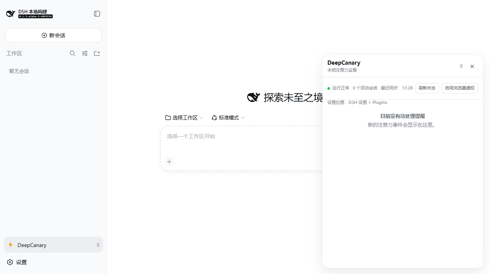

# dsh-deepcanary

[](https://github.com/Oscar-Williams/dsh-deepcanary/actions/workflows/ci.yml)
[](LICENSE)



> 让 DSH 在真正需要你判断时提醒你。

`dsh-deepcanary` 是面向 [DeepSeek Harness（DSH）](https://github.com/deepseek-ai/deepseek-harness) 的本地注意力监督插件。它读取 Session、Tool、Agent、Subagent 和 Host 的结构化运行时事实，经过确定性策略判断哪些事件应当保持安静、进入 Inbox，或提醒用户处理。

## 版本与兼容性

**当前候选版本**：`0.1.1-rc.1` 面向官方 DSH [`dsh-v0.1.2-alpha.5`](https://github.com/deepseek-ai/deepseek-harness/releases/tag/dsh-v0.1.2-alpha.5)，已完成 alpha.5 依赖切换、源码与测试回归，正在完成本轮 GitHub 与 npm `next` 发布。alpha.5 的官方发布说明聚焦旧运行时升级时的启动失败与会话标题丢失修复；本插件使用的 Gateway、client-module、WebServer、Session、Settings 和 Tools 接口保持兼容。alpha.5 的不可变 commit 为 `db6bdc3576c2d4e7c965e8e3ed0c2a731eed87f5`，本轮兼容性记录见 [`benchmark/alpha5-compatibility-receipt.json`](benchmark/alpha5-compatibility-receipt.json)。

公开 [`v0.1.0-rc.4 Release`](https://github.com/Oscar-Williams/dsh-deepcanary/releases/tag/v0.1.0-rc.4) 继续作为 alpha4 历史基线保存；其发布收据记录在 [`benchmark/release-candidate-receipt.json`](benchmark/release-candidate-receipt.json)。`0.1.1-rc.1` 延续 RC4 已验证的 Windows、WSL2、Node.js 22/24 和 WebUI 交互基础，并吸收 alpha.5 的持久化兼容修复、连接稳定性维护、通知投递证据、策略回放与 Supervisor 诊断能力。

当前 `main` 包含 RC4 之后的连接稳定性维护：主机探针按 outage epoch 去抖、前端状态请求采用退避与超时清理、通知记录绑定独立尝试 ID、Supervisor 支持 standby 自动接管、去重与打断预算写入有界快照。上述维护代码已完成本地构建和测试，公开 RC4 Release 文件保持不可变；需要验证这些维护内容时请按“从源码重建并验证”执行。

`0.1.1-rc.1` 适合本地试用、反馈和插件集成验证。物理触摸设备、真实屏幕阅读器和允许通知权限后的操作系统级通知属于独立的设备验收项；浏览器自动化、键盘操作、窄视口、强制颜色和通知拒绝分支已有自动化证据。

历史 [`v0.1.0-rc.3`](https://github.com/Oscar-Williams/dsh-deepcanary/tree/v0.1.0-rc.3) Git tag 保留用于版本对照；对应 npm 版本已撤销，npm 规则不允许复用。历史 [`v0.1.0-rc.2`](https://github.com/Oscar-Williams/dsh-deepcanary/tree/v0.1.0-rc.2) 与官方 DSH `dsh-v0.1.2-alpha.2` 的组合仍保留用于复现。`v0.1.0-rc.1` 以及 DSH npm `0.1.1-rc.2` 仅用于历史环境排查，不属于当前安装或测试基线。测试前请先停止 DSH，移除测试配置中的旧插件，再安装目标版本。

## 能解决什么问题

DeepCanary 只回答一个问题：当前是否值得用户看一眼？它不重新编排 Agent，也不替 DSH 执行高影响操作。

- 观察 Human Needed、Host 不可达、疑似停滞、工具失败循环、无有效进展、Subagent 压力、Context 压力和任务完成信号；
- 用 C0–C3 注意力等级、去重窗口、Decision Bundle 和小时预算压缩提醒噪声；
- 在 DSH Web 页面默认只显示侧栏入口；面板按需打开，可关闭、再次唤起、用鼠标或键盘缩放，并跟随 DSH 的中英文设置；
- 在面板中提供 Inbox、设置卡片和证据摘要；
- 支持确认、稍后提醒、静音、有效性反馈以及跳转提示；
- 仅提供本地元数据操作和 DSH 导航提示，不会终止或重启任务，不会自动批准或拒绝请求，也不执行任意命令。

核心原则是“证据先于升级”：C3 必须有 Host 或 Runtime 权威证据，模型判断不是本 RC 的必要依赖。

## 安装和启动

下面提供 GitHub tag、Release 附件和源码重建三条路径。GitHub tag 与 Release 附件适合日常试用；源码重建和本地压缩包适合开发、复现与提交问题。npm `next` 通道保留为后续发布路径。

### 环境要求

- Windows x64 或 WSL2 Ubuntu；
- Node.js `22.19+`（本次 RC 验证使用 Node.js `24.19.0`）；
- pnpm `11.7.0`；
- 已安装官方 DSH 源码运行时；当前兼容性基线使用 `dsh-v0.1.2-alpha.5`，commit 为 `db6bdc3576c2d4e7c965e8e3ed0c2a731eed87f5`。历史 RC4 验收仍固定在 alpha.4。

### GitHub tag 安装（当前候选）：v0.1.1-rc.1

以下命令从不可变 GitHub tag 安装 `0.1.1-rc.1`，适用于当前试用和验收。Release 页面同时提供相同版本的压缩包附件。

#### 1. 准备官方 DSH alpha.5

```powershell
git clone --depth 1 --branch dsh-v0.1.2-alpha.5 https://github.com/deepseek-ai/deepseek-harness.git dsh-runtime-alpha5
Set-Location .\dsh-runtime-alpha5
npx --yes pnpm@11.7.0 install
npx --yes pnpm@11.7.0 run build
npx --yes pnpm@11.7.0 dsh --version
git rev-parse HEAD
```

版本命令应输出 `0.1.2-alpha.5`，commit 命令应输出 `db6bdc3576c2d4e7c965e8e3ed0c2a731eed87f5`。已有本地 checkout 即使目录名仍为 `dsh-runtime-alpha1`，也应先确认 tag、commit 和 `dsh --version` 均符合上述值。

#### 2. 安装插件

推荐使用不可变 GitHub tag；需要离线验收时，可下载 Release 附件并使用本地压缩包安装。个人设计资料目录不属于安装来源。

```powershell
Set-Location .\dsh-runtime-alpha5
npx --yes pnpm@11.7.0 dsh plugin --profile web add https://codeload.github.com/Oscar-Williams/dsh-deepcanary/tar.gz/refs/tags/v0.1.1-rc.1
npx --yes pnpm@11.7.0 dsh --profile web --dump-config
npx --yes pnpm@11.7.0 dsh web --no-open
```

需要使用 Release 附件时，将下载后的压缩包路径传给同一条安装命令：

```powershell
npx --yes pnpm@11.7.0 dsh plugin --profile web add C:\path\to\dsh-deepcanary-0.1.1-rc.1.tgz
```

启动后，在同一台机器的浏览器打开 DSH Web 页面。`0.1.1-rc.1` 默认只保留侧栏入口，不会遮挡页面；点击入口后才打开浮动 Inbox。浏览器通知权限被拒绝时，面板和模型可见工具仍然可用。

### npm `next` 通道（本轮发布后可用）

npm 包将在本轮 GitHub 同步后发布到官方 registry 的 `next` 通道；发布完成后执行：

```powershell
$env:npm_config_registry = 'https://registry.npmjs.org/'
npx --yes pnpm@11.7.0 dsh plugin --profile web add dsh-deepcanary@next
```

更新已安装的 RC 时，先清理旧配置或执行：

```powershell
npx --yes pnpm@11.7.0 dsh plugin --profile web update dsh-deepcanary
```

### 卸载与回滚

在目标 DSH profile 中移除插件：

```powershell
npx --yes pnpm@11.7.0 dsh plugin --profile web remove dsh-deepcanary
```

需要重新安装当前版本时，重新执行相应的 `0.1.1-rc.1` 安装命令；需要复现 RC4、RC3 或 RC2 时，分别使用对应 tag 和匹配的 DSH 运行时。完成替换后重启 `dsh web`，并用 `dsh plugin --profile web list` 确认 profile 中只保留目标版本。

### 从源码重建并验证 0.1.1-rc.1

需要调试源码或复现构建时，可使用官方 DSH `dsh-v0.1.2-alpha.5` 和独立测试配置；请将 `$pluginDir`、`$dshDir` 改为本机路径。该流程生成的本地压缩包是当前最可靠的验收来源，也可在公共发布完成后继续用于比对。

```powershell
$pluginDir = 'C:\path\to\dsh-deepcanary'
$dshDir = 'C:\path\to\dsh-runtime-alpha5'
$testHome = Join-Path $env:USERPROFILE '.dsh-deepcanary-test'

git clone --depth 1 --branch dsh-v0.1.2-alpha.5 https://github.com/deepseek-ai/deepseek-harness.git $dshDir
Set-Location $dshDir
npx --yes pnpm@11.7.0 install --frozen-lockfile
npx --yes pnpm@11.7.0 run build
npx --yes pnpm@11.7.0 dsh --version
git rev-parse HEAD

Set-Location $pluginDir
npm ci
npm run build
$packDir = Join-Path $env:TEMP 'dsh-deepcanary-local-pack'
New-Item -ItemType Directory -Force $packDir | Out-Null
npm pack --pack-destination $packDir
$packageVersion = (Get-Content .\package.json | ConvertFrom-Json).version
$tarball = Join-Path $packDir "dsh-deepcanary-$packageVersion.tgz"

Set-Location $dshDir
$env:DSH_HOME = $testHome
npx --yes pnpm@11.7.0 dsh plugin --profile web remove dsh-deepcanary
npx --yes pnpm@11.7.0 dsh plugin --profile web add $tarball
npx --yes pnpm@11.7.0 dsh --profile web --dump-config
npx --yes pnpm@11.7.0 dsh web --no-open
```

`dsh --version` 应输出 `0.1.2-alpha.5`，`git rev-parse HEAD` 应输出 `db6bdc3576c2d4e7c965e8e3ed0c2a731eed87f5`，本地压缩包应显示 `0.1.1-rc.1`。`cordis.patch.yml` 使用 DSH 的 `dshHomePath('dsh-deepcanary')`，因此设置 `DSH_HOME` 后，插件状态会跟随独立 DSH home 保存。开始 Web UI 手测前，请确认测试配置已加载当前压缩包，并且页面只显示侧栏入口，不再出现固定在右侧的旧卡片。源码维护版本还应检查 `/dsh-deepcanary/health`、`/dsh-deepcanary/state` 中的探针状态、outageId 和 Supervisor 状态。

### WebUI 交互

- **隐藏**：插件启动后不渲染 Inbox 面板；关闭按钮、`Esc` 或面板外点击都会隐藏它，外部 DSH 页面仍可操作。
- **唤起**：点击侧栏底部的 DeepCanary 入口即可重新打开；打开后焦点落到关闭按钮，关闭后返回入口。
- **通知回跳**：浏览器已授予通知权限时，点击 C2/C3 通知会聚焦 DSH、打开对应提醒，并将目标条目滚动到面板可见区域。
- **缩放**：面板右侧和底部提供可聚焦的调整手柄，支持鼠标拖动以及方向键、`Home`、`End`；尺寸会在浏览器允许时保存在本地。
- **双语**：面板文案、原因说明、建议、证据类型、操作按钮和设置字段注册到 DSH locale，切换 DSH 的中文/English 后实时更新。

## Web 与工具接口

插件向 DSH 本地 WebServer 注册以下同源接口：

| 接口 | 用途 |
| --- | --- |
| `/dsh-deepcanary/state` | 状态、设置和待处理 Inbox 快照 |
| `/dsh-deepcanary/settings` | 读取或校验并更新体验设置 |
| `/dsh-deepcanary/health` | 插件健康检查 |
| `/dsh-deepcanary/explain?id=...` | 读取单条 Inbox 的隐私安全决策解释 |
| `/dsh-deepcanary/dry-run` | 只读比较当前与候选提醒策略 |
| `/dsh-deepcanary/action` | 确认、静音、稍后提醒、反馈和跳转提示 |
| `/dsh-deepcanary/outcome` | 记录一条脱敏的决策结果，供本地 dogfood 复盘 |
| `/dsh-deepcanary/outcomes` | 读取经过筛选的 OutcomeReceipt，不返回会话正文 |
| `DELETE /dsh-deepcanary/outcomes` | 按明确的 trial 或时间边界删除本地结果记录 |
| `/dsh-deepcanary/supervisor` | 读取后续版本 Persistent Supervisor 原型的本地快照、租约状态和资源计数 |

DSH 模型可使用九个工具：

`deepcanary_status`、`deepcanary_inbox`、`deepcanary_acknowledge`、`deepcanary_snooze`、`deepcanary_mute`、`deepcanary_feedback`、`deepcanary_explain`、`deepcanary_dry_run`、`deepcanary_jump`。

### 记录一次脱敏结果

dogfood 或受控试验可以在产生提醒后，使用 Inbox 条目的 `id` 调用 `/dsh-deepcanary/outcome`。`source` 必须明确填写为 `real`、`controlled` 或 `replay`，`trialId` 使用不含路径和敏感内容的本地试验标识：

```json
{
  "id": "<Inbox item id>",
  "source": "real",
  "trialId": "manual-alpha5-01",
  "opened": true,
  "acknowledged": true,
  "feedback": "useful",
  "laterOutcome": "continued",
  "recoveredBeforeOpen": false,
  "latencyBucket": "under-1m",
  "reviewFlags": []
}
```

随后使用 `GET /dsh-deepcanary/outcomes?source=real&trialId=manual-alpha5-01` 读取结果。记录文件为本地状态目录中的 `outcomes.json`；真实、受控和回放数据应使用不同的 `trialId` 或独立状态目录，并通过 [`benchmark/outcome-receipt.schema.json`](benchmark/outcome-receipt.schema.json) 约束字段。试验撤回或达到保留期限后，可使用 `DELETE /dsh-deepcanary/outcomes?source=real&trialId=manual-alpha5-01`，或提供明确的 `before=<ISO 日期>` 进行定点清理；删除请求必须包含 trial 或时间边界。

设置卡片通过 DSH 标准 `settings.plugin.item` 位置暴露通知级别、自动唤起策略、每小时打断预算、静默时段、长时间阈值、Subagent 压力档位、相邻事件合并窗口和隐私安全摘要选项。挂载 `@deepseek-ai/dsh-settings` 后，设置通过 `dsh-deepcanary` namespace 实时生效；没有该 provider 时，插件仍按 bundle 配置工作。

客户端通过包 manifest 的 `dsh.client` 声明和 `./client` 导出接入 DSH alpha.5 客户端模块加载器；面板入口贡献到 `sidebar.footer.action`，浮动面板贡献到 `shell.overlay`，设置卡贡献到标准 `settings.plugin.item`。alpha.5 保留的 `SessionSeq` 内部类型变化不影响本插件使用的 `sessions.open(SessionId)` 导航接口。

## 注意力策略

| 等级 | 含义 | 默认处理 |
| --- | --- | --- |
| C0 | 正常进展 | 保持安静 |
| C1 | 稍后值得查看 | Inbox / 状态点 |
| C2 | 人工判断已成为瓶颈 | 打断候选 + Inbox |
| C3 | 高影响阻塞或主机风险 | 强提醒候选 + Inbox |

正常完成固定为 `C1`。同一根因的相邻事件会形成一个 Decision Bundle，保留原因码、事件数量和有限证据摘要；重复信号仍受去重窗口约束。C2 使用滚动小时预算，并在静默时段降为 Digest；C3 不消耗普通 C2 预算，仍执行去重，但不因静默时段而被隐藏。

## 隐私与安全边界

默认状态目录跟随 DSH 的 home，bundle 配置使用 `dshHomePath('dsh-deepcanary')`；未设置 `DSH_HOME` 时通常对应 `~/.dsh/dsh-deepcanary`。其中的 `inbox.json` 保存提醒元数据，`outcomes.json` 保存脱敏结果记录；后续版本原型还会生成有界的 `supervisor.json` 与短租约 `supervisor.lease`。这些文件保存时间、等级、原因码、哈希化的 Session/Workspace 引用、证据摘要、Bundle 元数据、用户反馈和结果枚举；当 DSH 提供会话入口时，`inbox.json` 还会保存长度受限的本地 opaque session handle，用于调用原生 `sessions.open` 回到对应线程。Prompt、模型输出、工具参数、凭据、原始工具结果和完整会话内容留在 DSH，不写入 DeepCanary 状态文件。

Web 接口使用同源本地 WebServer 和 `no-store` 响应；客户端通过 DOM `textContent` 渲染动态字段，不拼接 `innerHTML`。插件不提供 shell、文件写入、终止、重启、批准或拒绝工具。不要把 DSH WebServer 暴露到未经认证的公网反向代理后面。

## 常见问题

- **侧栏入口或面板没有出现**：先停止已有的 `dsh web`，在相同 profile 执行 `dsh plugin --profile web list` 和 `dsh --profile web --dump-config`，确认目标版本与 `dsh-deepcanary` bundle 都已加载；随后重新安装目标包并启动 Web UI。
- **页面右侧仍有旧卡片**：这通常来自旧 profile 或旧版页面注入插件。移除测试 profile 中的旧 `dsh-deepcanary` 条目，使用当前版本重新安装，并确认页面只保留侧栏入口。
- **Web UI 显示“连接中”或“连接异常”**：连接状态由 DSH WebSocket、插件状态请求和本地主机探针共同影响，三者需要分别定位。先访问 `http://127.0.0.1:<端口>/dsh-deepcanary/health`，HTTP 200 且返回 `"ok": true` 表示插件服务正常；再检查 `dsh --profile web --dump-config`、终端中的 DSH 进程和浏览器页面是否使用同一端口。打开 `/dsh-deepcanary/state` 查看 `delivery.hostProbe.state`、`consecutiveFailures`、`outageId` 和 `lastCheckedAt`：单次失败会继续观察，连续达到阈值才打开一条 outage epoch，恢复后会记录同一 outageId 的 recovery。短暂状态波动可先等待下一轮退避同步。每次重新启动 `dsh web` 都会生成新的启动 token；请使用本次启动终端打印的新 URL 重新打开或刷新页面，旧页面的会话凭据会随旧 token 失效。alpha.5 的 Gateway 使用 2 秒 Ping/Pong 心跳，主机事件循环或网络短暂阻塞时可能触发重连。持续失败时关闭旧的 DSH 进程后重新运行 `dsh web --no-open`，并保留终端显示的本机访问地址和一次性 token。
- **需要模型调用**：在 DSH 自己的设置中配置 API key；DeepCanary 不读取或保存凭据。无 API key 时，健康检查、面板和离线测试仍可运行。

## 验证与发布基线

本仓库提交构建后的 `lib/`，因为 DSH 从公开 Git tag 安装时不应依赖本仓库的 TypeScript 工具链。开发检查：

```powershell
npm ci
npm run typecheck
npm run typecheck:tests
npm test
npm run build
npm run verify:distribution
npm pack --dry-run
```

仓库还提供本地质量与可靠性检查：

```powershell
npm run quality:report
npm run benchmark:attention
npm run outcomes:report -- --input <path-to-outcomes.json> --source real
npm run replay:policy
npm run supervisor:smoke
npm run dogfood:report -- --input <path-to-sanitized-dogfood.json>
npm run gate:stable -- --dogfood <path-to-sanitized-dogfood.json>
npm run dogfood:merge -- --input <run-a.json> --input <run-b.json> --out output/dogfood/aggregate.json
npm run dogfood:capture -- --state-dir <isolated-dsh-state-dir> --run-id <run-id> --trial-id <trial-id> --task-family coding --scenario normal-completion --started-at <ISO-start> --ended-at <ISO-end> --out output/dogfood/run.json
npm run notification:evidence -- --input <path-to-notification-evidence.json> --dogfood <path-to-sanitized-dogfood.json>
```

质量报告、Outcome 报告、策略回放和 dogfood 报告只保存汇总结果；原始试用数据应留在隔离测试目录，具体字段和隐私边界见 [`docs/dogfood-protocol.md`](docs/dogfood-protocol.md)。策略回放会执行判断、投递策略、去重、Bundle、静默时段、预算和恢复链路，并输出逐案例结果；使用 `--candidate <path-to-config.json>` 可比较候选设置，回放使用确定性时钟并保留允许的结构化信号数据。dogfood 报告要求脱敏机会记录，能够保留 C0、去重、抑制和漏提醒等没有 Inbox 条目的样本；跨任务试用应先按 run 分开，再用 `dogfood:merge` 汇总。Outcome 报告使用 [`benchmark/outcome-report.schema.json`](benchmark/outcome-report.schema.json)，同一次汇总只接收一个 `source`。Windows 通知验收需提供 [`benchmark/notification-evidence.schema.json`](benchmark/notification-evidence.schema.json) 规定的人工观察记录：OS 字段使用 `observed`、`not-observed`、`not-tested` 三态，并绑定 run window、notificationAttemptId、browserReceiptRef、截图哈希和 UIA 哈希；浏览器权限和 `Notification` 构造调用单独形成浏览器阶段记录。`npm run gate:stable` 会新建策略回放、Supervisor smoke、包摘要和工作树身份记录，输出中明确 package version、runtime baseline、source digest 和 tarball SHA-256。RC4 的安装、测试和发布记录在 [`benchmark/release-candidate-receipt.json`](benchmark/release-candidate-receipt.json)；alpha.3 的历史兼容性记录仍保存在 [`benchmark/alpha3-compatibility-receipt.json`](benchmark/alpha3-compatibility-receipt.json) 中。

当前 RC4 沿用并重新验证 AttentionGold v3，固定覆盖 20 个分类场景，以及重复、共享根因 Bundle、恢复复发和多 Session 场景；RC2 收据仍记录历史 v2 的 15 个分类场景。RC2 的官方运行时、Windows/WSL、公开 tag 安装、Web、设置、卸载重启和分发完整性证据记录在仓库内的 [`benchmark/release-receipt.json`](benchmark/release-receipt.json)，收据状态为 `PASS`。RC2 历史文件与 RC4 收据都不进入 npm 运行包，以避免与发布包 SHA-256 形成循环依赖。可复现检查步骤见 [`docs/release-checklist.md`](docs/release-checklist.md)。

## 文档

- [`docs/README.md`](docs/README.md)：文档导航；
- [`docs/architecture.md`](docs/architecture.md)：插件如何接收 DSH 运行信息、判断提醒级别并提供 Web 与工具接口；适合开发者阅读；
- [`docs/dsh-surface-audit.md`](docs/dsh-surface-audit.md)：插件使用的 DSH 接口、版本和兼容注意事项；
- [`docs/compatibility.md`](docs/compatibility.md)：DSH 版本、操作系统、Node.js 与已知限制；
- [`docs/security.md`](docs/security.md)：保存哪些数据、提供哪些操作以及安全注意事项；
- [`docs/dogfood-protocol.md`](docs/dogfood-protocol.md)：如何进行脱敏试用、质量评估和本地性能测试；
- [`benchmark/outcome-receipt.schema.json`](benchmark/outcome-receipt.schema.json)、[`benchmark/outcome-report.schema.json`](benchmark/outcome-report.schema.json)、[`benchmark/dogfood-aggregate.schema.json`](benchmark/dogfood-aggregate.schema.json) 与 [`benchmark/notification-evidence.schema.json`](benchmark/notification-evidence.schema.json)：结果、跨 run 试用汇总和 Windows 通知观察的公开字段约束；
- [`docs/release-checklist.md`](docs/release-checklist.md)：发布前逐项执行的验证清单。

## 反馈与贡献

欢迎提交可复现的问题、测试改进和文档修订。反馈 Web UI 或兼容性问题时，请附上 DSH 的准确版本标签与 commit、插件 tag 或 commit、操作系统、Node.js 版本、复现步骤和脱敏后的日志；请不要提交 API key、Prompt、会话内容、工作区路径或原始工具结果。代码、测试和文档贡献请先阅读 [`CONTRIBUTING.md`](CONTRIBUTING.md)。

## 许可证

MIT
